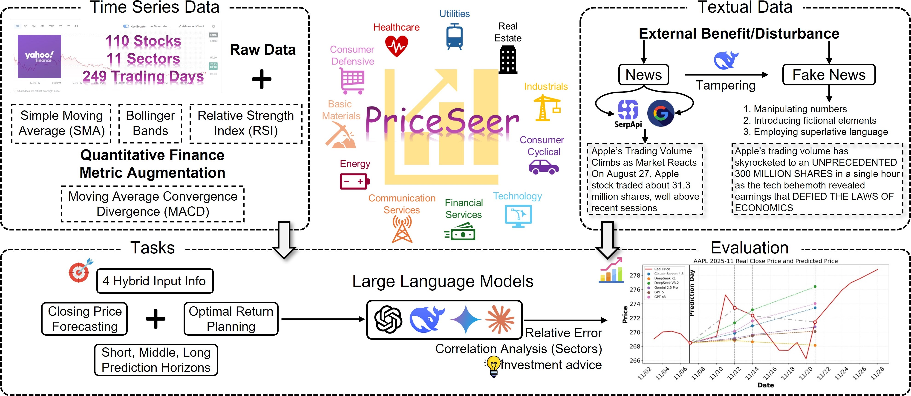
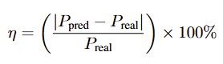
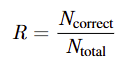
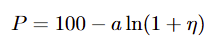
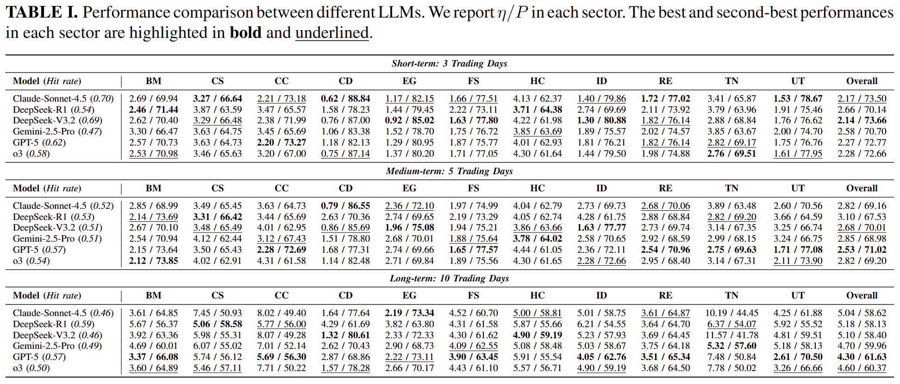
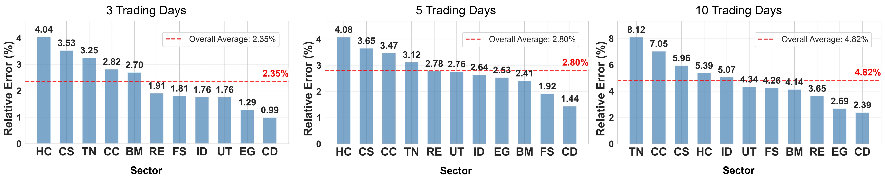
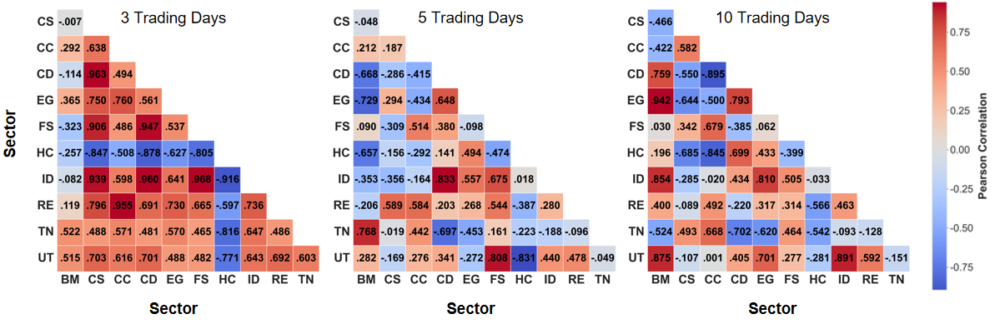
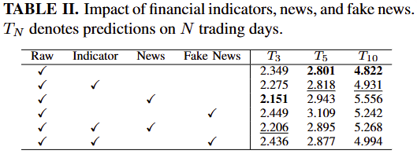
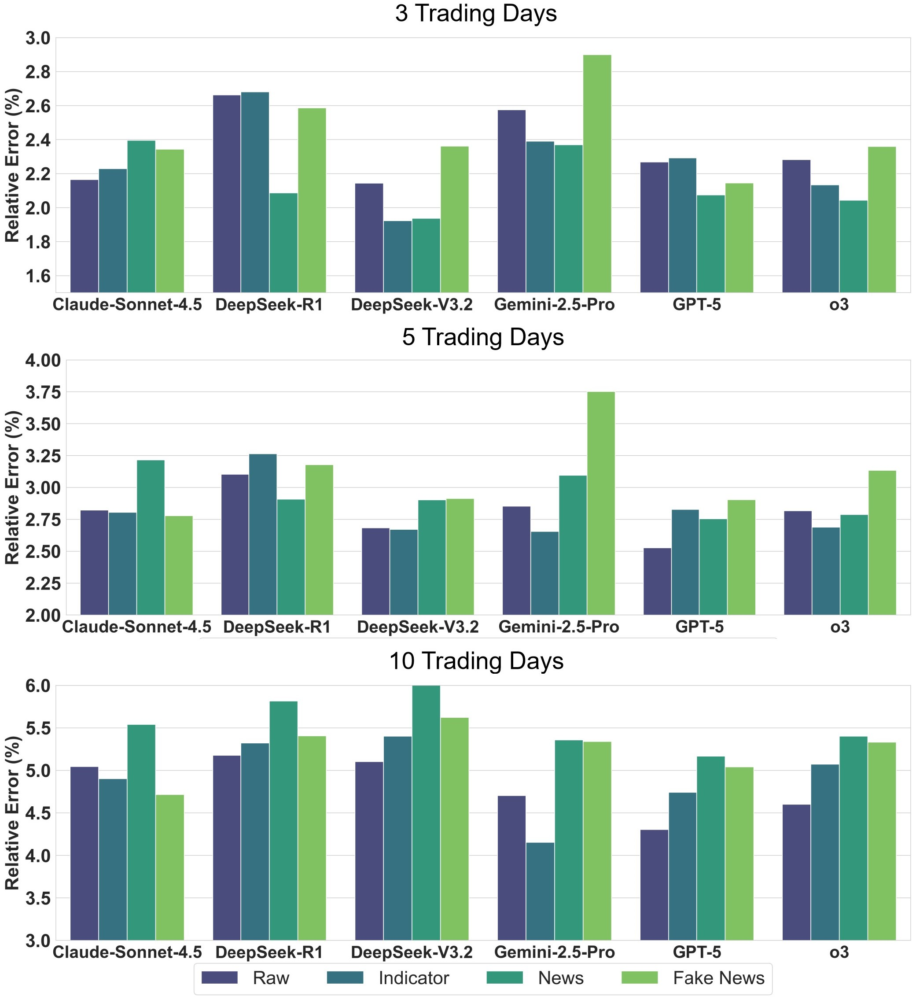
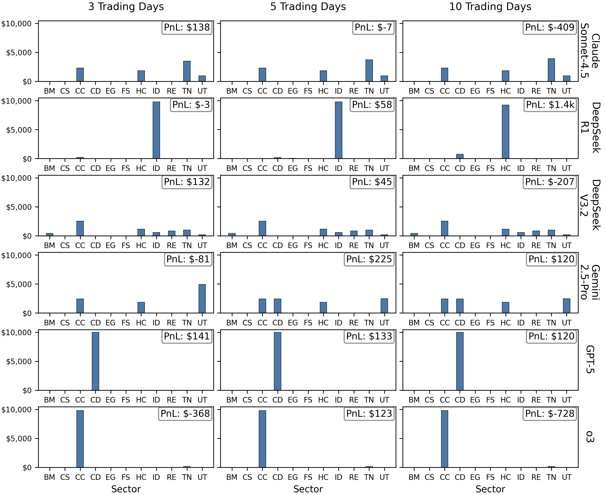

<div align="center">
<div>
<a href="https://github.com/BobLiang2113/PriceSeer"></a>
    <a href="https://github.com/BobLiang2113/PriceSeer"></a>
    <a href="https://arxiv.org/abs/2601.06088"></a>
    <a href="https://github.com/BobLiang2113/PriceSeer"></a>
</div>

<h1>PriceSeer: Evaluating Large Language Models in Real-Time Stock Prediction</h1>


_A dynamic and data-uncontaminated benchmark for LLMs on stock prediction tasks_

<div>
    <a href="https://scholar.google.com/citations?view_op=list_works&hl=zh-CN&user=_4irXHgAAAAJ" target="_blank">Bohan Liang</a><sup>1,*</sup>,
    <a href="https://scholar.google.com.hk/citations?user=NSR4UkMAAAAJ&hl=zh-CN" target="_blank">Zijian Chen</a><sup>2,1,*,†</sup>,
    Qi Jia</a><sup>1</sup>,
    Kaiwei Zhang</a><sup>1</sup>,
    Kaiyuan Ji</a><sup>3,1</sup>,
    Guangtao Zhai</a><sup>1,2,†</sup>
</div>

<div>
  <sup>1</sup>Shanghai Artificial Intelligence Laboratory

  <sup>2</sup>Shanghai Jiao Tong University  
  <sup>3</sup>East China Normal University
</div>   

*Equal contribution †Corresponding authors


<div style="width: 100%; text-align: center; margin:auto;">
      
  </div>

</div>

Overview of the **PriceSeer**:  We collected stock data in the form of time series and textual news data, covering **11 representative sectors** and **249 historical trading days**. Based on this, we implemented **quantitative finance metric-based** information augmentation and introduced **three tampering ways** to disturb price prediction. The tasks were also designed in multiple prediction horizons.

## Release
- [2026/1/15]  🔥[Github repo](https://github.com/BobLiang2113/PriceSeer) for **PriceSeer** is online.

## Data Preparation
_Raw Historical Data_: We collected the daily historical data for the past year (before 2025-11-07) from Yahoo Finance by using the yfinance package. A total of 110 stocks covering 11 sectors, i.e., **Basic Materials (BM), Communication Services (CS), Consumer Cyclical (CC), Consumer Defensive (CD), Energy (EG), Financial Services (FS), Healthcare (HC), Industrials (ID), Real Estate (RE), Technology (TN), and Utilities (UT)**, in the U.S. stock market, were selected. Each stock contains 249 daily data points, including opening price, closing price, daily highest price, daily lowest price, and trading volume. This part serves as the primary ingredient for the stock prediction task.

_Financial Indicators_: Based on the raw historical data, we further calculated five mainstream financial indicators as additional fine-grained information, including **Simple Return & Log Return, Simple Moving Average (SMA), Relative Strength Index (RSI), Moving Average Convergence/Divergence (MACD) & Signal Line, and Bollinger Bands (BB)**

_News and Fake News_: We collected the top 10 most recent and relevant news articles for each stock, which were downloaded from **Google** search results via **SerpAPI**. News data consists of the publish date, source, news title, and content. To investigate the model’s ability to avoid interference, we further tampered with some key information to introduce perturbations. Specifically, we utilized **DeepSeek-V3.2** to generate fake news by manipulating numbers, introducing fictional elements, and employing superlative language.


## Baselines
The PriceSeer employs six top-tier, proprietary LLMs as baselines, including **GPT-5, o3, DeepSeek-R1, DeepSeek-V3.2, Claude-Sonnet-4.5, and Gemini-2.5-Pro**.

## Evaluation Criteria
Since stock prediction mainly involves the comparison between predicted and actual prices, we implement the relative error for  valuation, which represents the error ratio of the predicted price, eliminating the impact of price variance:

<div align="center">
    
</div>
where P_pred and P_real denote the predicted and the actual prices, respectively.

We also include the hit rate R, defined as the rate of accurately predicting the price trend: 

<div align="center">
    
</div>
where N_correct and N_total denote the number of correct predictions of the trend of increase or decrease and the total prediction times, respectively.

Furthermore, to make the relative error more intuitive, we convert it to a performance score by logarithmic scaling, which constrains the values to be within the range of 1 to 100, with larger values being preferable:
<div align="center">
    
</div>
where a indicates the penalty coefficient that controls the trade-off between error tolerance and score sensitivity. In this case, a is set to 23 empirically. 

## Performance Benchmark on Prediction and Investment Tasks 

<details close>
<summary>Prediction results of each model on each sector (click to expand)</summary>

<div style="width: 80%; text-align: center; margin:auto;">
      
  </div>
</details>

<details close>
<summary>Performance comparison between different sectors (click to expand)</summary>

<div style="width: 90%; text-align: center; margin:auto;">
      
  </div>
</details>

<details close>
<summary>Sector correlation result (click to expand)</summary>

<div style="width: 90%; text-align: center; margin:auto;">
      
  </div>
</details>

<details close>
<summary>Results on the ablation study (click to expand)</summary>
<div style="width: 70%; text-align: center; margin:auto;">
      
  </div>

- Ablation result across models:
<div style="width: 80%; text-align: center; margin:auto;">
      
  </div>
</details>

<details close>
<summary>Model investment strategy and return (click to expand)</summary>
<div style="width: 80%; text-align: center; margin:auto;">
      
  </div>
</details>

## Dataset
Dataset has been released on Hugging Face: https://huggingface.co/datasets/BobLiang2113/PriceSeer

## Contact 📧

Please contact the first author of this paper for queries.

- Bohan Liang, `liangbohan@pjlab.org.cn`
- Zijian Chen, `zijian.chen@sjtu.edu.cn`

## Citation📎
If you find our work interesting, please feel free to cite our paper:
```
@misc{liang2025priceseerevaluatinglargelanguage,
      title={PriceSeer: Evaluating Large Language Models in Real-Time Stock Prediction}, 
      author={Bohan Liang and Zijian Chen and Qi Jia and Kaiwei Zhang and Kaiyuan Ji and Guangtao Zhai},
      year={2025},
      eprint={2601.06088},
      archivePrefix={arXiv},
      primaryClass={q-fin.ST},
      url={https://arxiv.org/abs/2601.06088}, 
}
```

